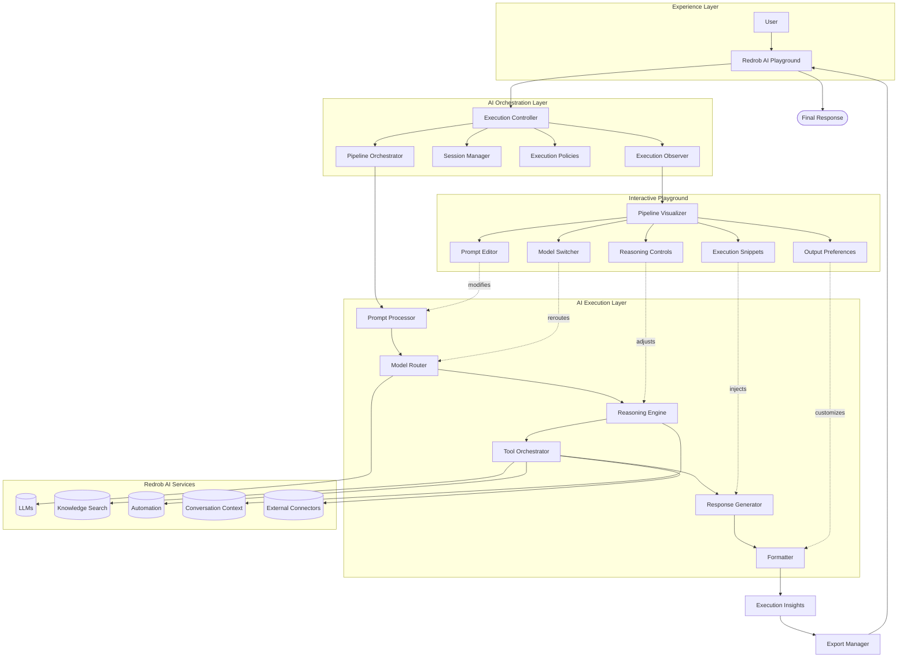

# SYSTEM ARCHITECTURE

```mermaid
flowchart TB

%%====================================================
%% EXPERIENCE LAYER
%%====================================================

subgraph EXP["Experience Layer"]
    U[User]
    UI[Redrob AI Playground]
    U --> UI
end

%%====================================================
%% ORCHESTRATION LAYER
%%====================================================

subgraph ORCH["AI Orchestration Layer"]

    EC[Execution Controller]

    PIPE[Pipeline Orchestrator]

    SESSION[Session Manager]

    POLICY[Execution Policies]

    OBS[Execution Observer]

    UI --> EC

    EC --> PIPE
    EC --> SESSION
    EC --> POLICY
    EC --> OBS

end

%%====================================================
%% AI EXECUTION LAYER
%%====================================================

subgraph EXEC["AI Execution Layer"]

    PP[Prompt Processor]

    MR[Model Router]

    RE[Reasoning Engine]

    TOOL[Tool Orchestrator]

    GEN[Response Generator]

    FORMAT[Formatter]

    PIPE --> PP

    PP --> MR

    MR --> RE

    RE --> TOOL

    TOOL --> GEN

    GEN --> FORMAT

end

%%====================================================
%% PLAYGROUND INTERACTION LAYER
%%====================================================

subgraph PLAY["Interactive Playground"]

    VIEW[Pipeline Visualizer]

    EDIT[Prompt Editor]

    SWITCH[Model Switcher]

    CTRL[Reasoning Controls]

    SNIP[Execution Snippets]

    PREF[Output Preferences]

end

OBS --> VIEW

VIEW --> EDIT
VIEW --> SWITCH
VIEW --> CTRL
VIEW --> SNIP
VIEW --> PREF

EDIT -. modifies .-> PP

SWITCH -. reroutes .-> MR

CTRL -. adjusts .-> RE

SNIP -. injects .-> GEN

PREF -. customizes .-> FORMAT

%%====================================================
%% REDROB SERVICES
%%====================================================

subgraph REDROB["Redrob AI Services"]

    MODELS[(LLMs)]

    SEARCH[(Knowledge Search)]

    WORKFLOW[(Automation)]

    MEMORY[(Conversation Context)]

    API[(External Connectors)]

end

MR --> MODELS

TOOL --> SEARCH

TOOL --> API

TOOL --> WORKFLOW

RE --> MEMORY

%%====================================================
%% OUTPUT LAYER
%%====================================================

FORMAT --> REPORT[Execution Insights]

REPORT --> EXPORT[Export Manager]

EXPORT --> UI

UI --> R([Final Response])
```
